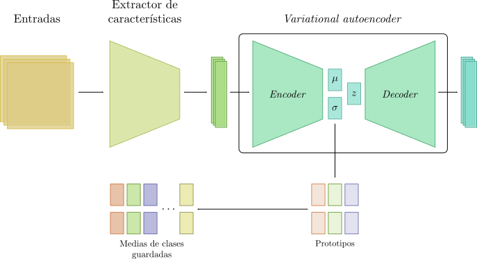

# ICL with a VAE

Based on [Autoencoder-Based Incremental Class Learning without Retraining on Old Data](http://arxiv.org/abs/1907.07872) by Choi et al. (2019).

Replaces the _autoencoder_ component with a _variational autoencoder_.